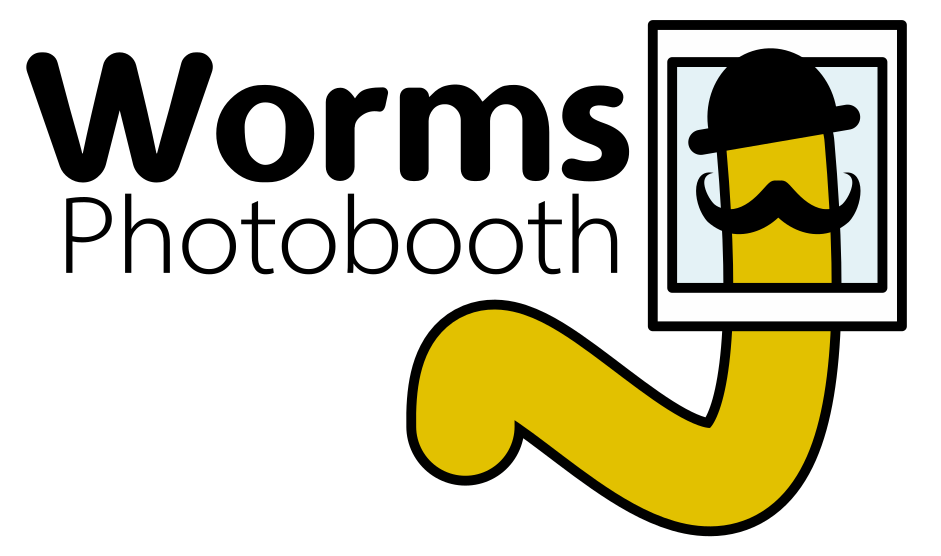

# M2_CIML_Automated-image-capture  
## Project abstract
Applicant: Jérôme Belougne  
Institute: CIML  
Engineer: Mathias Lechelon  
Submission date: 15/07/2020  
Summary : <em>Optimize the automation of the image capture already present ( DMS300 / Workstation Tecan gemini).
The aim of the optimization will be to replace the currently used automaton with an X-Y automated platform system.
Create a plexiglass enclosure to control the environment (humidity, temperature) around the camera and the X-Y platform.
Optimize the imaging instrument, to obtain higher quality images.</em>
  
## How it works
This code aims to track worms (*C.Elegans*) in 24 wells plates, placed inside a CNC router frame. The plates are fixed, and the camera move above/below (depending on the preferences) each well to take a picture. This is repeated n times.

## How to start the code
The double click on <span>main.py</span> (located in M2_CIML_Automated-image-capture/RaspberryiPi/). On the RaspberryPi board the file should open in a IDE such as *thonny*. Then click the green arrow to start the code.

## How to change parameters
If you wish to change some parameters, open the <span>config.py</span> file and change them as needed. 

## Quick explanantion of the code
The code is subdivided into 3 main files:
* <span>config.py</span>, containing the main parameters that can be modify;
* <span>functions.py</span>, containing 3 functions to control the camera. 
    * *well_scanning_zigzag* : a function to scan all wells of 24 well plates. The path is visible in <span style="color:orange">orange</span> on the figure below;
    * *box_scanning_zigzag* : a function to scan all boxes placed on the router. The path is visible in <span style="color:blue">blue</span> on the figure below;
    * *camera_control* : a function that starts the serial communication with the Arduino board, and control the camera according the X and Y coordinates obtained from the previous functions. The resulting path is visible on the figure below in <span style="color:green">green</span>.
* <span>main.py</span>

## Command Line Interface (CLI), and how to use it
The file is refered as cli.py in the RaspberryPi folder.  
Steps:  
* Open the terminal (LXTerminal);  
* Change directory to go into the RaspberryPi folder, where the cli.py file is located.  
    ```cd Desktop/M2_CIML_Automated-image-capture/RaspberryPi/```
* To start the scan with default parameter (12 wells boxes, 30 min of delay, 48 hours long):
    ```python cli.py```
    Options:
    * ```--box``` to define the type of box (available options : 6, 12);
        * *Example to use 12 wells boxes: ```python cli.py --box 6```*
    * ```--delay``` to define the delay between each scan. With format hh:mm:ss.
        * *Example to set a 50 min delay: 00:50:00: ```python cli.py --delay 00:50:00```*
    * ```--duration``` to define the total duration of the experiment. With format hh:mm:ss.
        * *Example to set a 24 hours long experiment: ```python cli.py --duration 24:00:00```
    * *Example to set an experiment with 6 wells boxes, with 40 minutes delay, and a total duration of 36 hours: ```python cli.py --box 6 --delay 00:40:00 --duration 36:00:00```.
* Once you type *Enter* a resume of the selected parameters appears. You can type *y* (for yes) if you want to run the scan with the selected parameters. Or type *n* (for no) to abort the scan.

## Yet to do
* ~~Placing the end stops on the frame, on each axis;~~
* ~~Defining the bottom left well as the zero position.~~
* ~~Move arg_def(from functions.py) into cli.py~~
* Write a small user guide for the cli into readme
* Update the scheme below with the current path
* Make a scheme for electronics
* ~~Add the config.h file with modification for grbl~~

